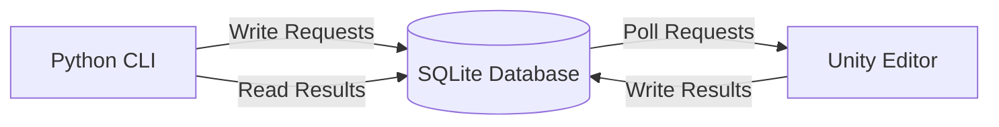
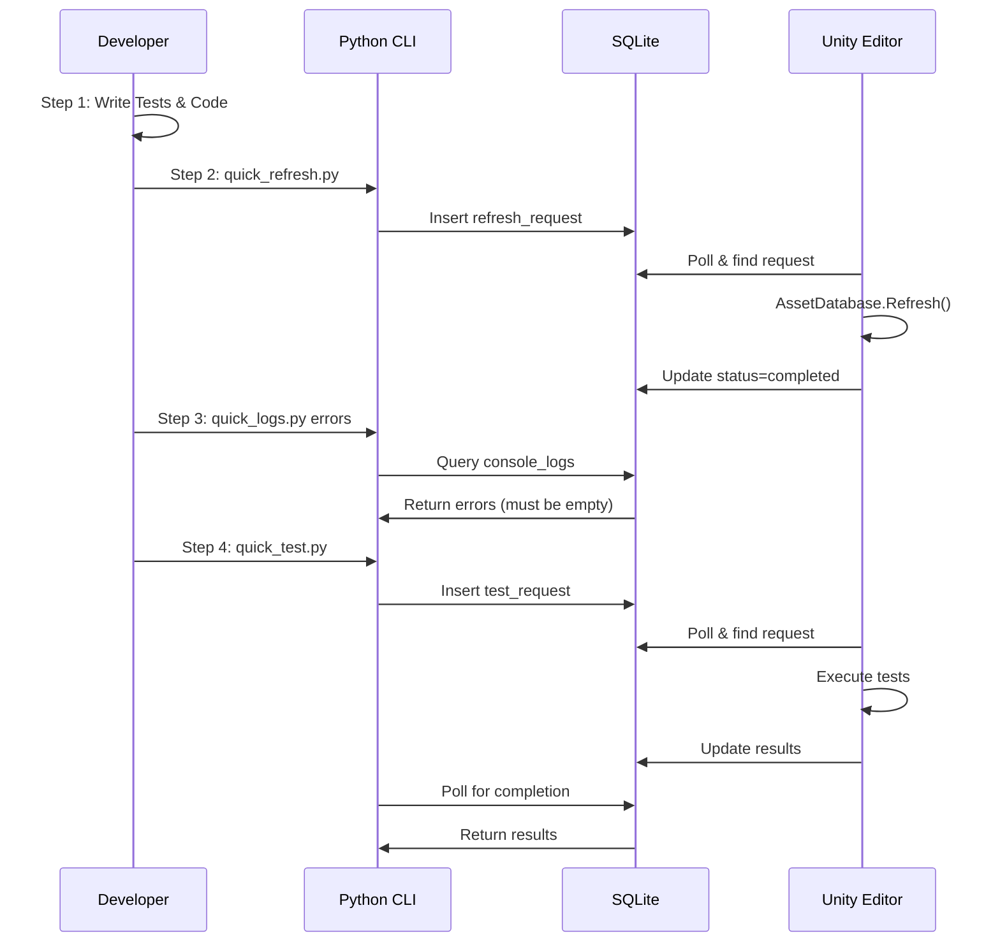

# PerSpec Architecture Guide

> **Purpose**: Comprehensive technical architecture documentation for LLM understanding of the PerSpec Test-Driven Development framework for Unity.

## Table of Contents

1. [Core Architecture Overview](#core-architecture-overview)
2. [The 4-Step TDD Workflow Engine](#the-4-step-tdd-workflow-engine)
3. [Database Coordination Layer](#database-coordination-layer)
4. [Python-Unity Bridge](#python-unity-bridge)
5. [Unity Integration Components](#unity-integration-components)
6. [Testing Framework Core](#testing-framework-core)
7. [Optimization Opportunities](#optimization-opportunities)

---

## Core Architecture Overview

### System Design Philosophy

PerSpec implements a **producer-consumer architecture** with SQLite as the message queue:



### Key Architectural Decisions

1. **SQLite as Message Queue**: Single source of truth, no file watching needed
2. **Background Polling**: System.Threading.Timer continues when Unity loses focus
3. **Thread Marshalling**: Database operations on background thread, Unity APIs on main thread
4. **WAL Mode**: Write-Ahead Logging enables concurrent read/write access
5. **Status-Based State Machine**: Simple, reliable state transitions

### Technology Stack

| Component | Technology | Purpose |
|-----------|-----------|---------|
| Database | SQLite 3 with WAL | Message queue & state storage |
| Unity Integration | C# with SQLite-net | Database access & test execution |
| CLI Tools | Python 3 with sqlite3 | User interface & automation |
| Async Framework | UniTask | Zero-allocation async/await |
| Background Processing | System.Threading.Timer | Continuous polling |
| Thread Sync | SynchronizationContext | Main thread marshalling |

### Component Relationships

```
PerSpec/
├── test_coordination.db                 # Central SQLite database
├── Coordination/Scripts/                # Python CLI tools
│   ├── quick_test.py                   # Test execution
│   ├── quick_refresh.py                # Asset refresh
│   └── quick_logs.py                   # Log viewing
│
Packages/com.digitraver.perspec/
├── Editor/Coordination/                 # Unity-side coordination
│   ├── Core/
│   │   ├── BackgroundPoller.cs         # Polling engine
│   │   ├── SQLiteManager.cs            # Database access
│   │   └── TestExecutor.cs             # Test runner
│   └── TestExecution/
│       └── PlayModeTestCompletionChecker.cs
└── Runtime/                            # Test support
    ├── Unity/Helpers/                  # UniTask patterns
    └── Debug/                          # Logging system
```

---

## The 4-Step TDD Workflow Engine

### Workflow Implementation

The 4-step workflow is enforced through database state transitions and validation:



### State Transitions

Each request follows a strict state machine:

```python
# Database states (enforced by CHECK constraints)
STATES = ['pending', 'running', 'completed', 'failed', 'cancelled']

# State transitions
pending → running → completed/failed
pending → cancelled
running → cancelled (with cleanup)
```

### Validation Checkpoints

1. **Pre-refresh**: Ensure no pending operations
2. **Post-refresh**: Verify compilation success
3. **Pre-test**: Check no compilation errors exist
4. **Post-test**: Validate all tests passed

### Error Handling Patterns

```csharp
// Unity-side error handling
try {
    var request = _dbManager.GetNextPendingRequest();
    _dbManager.UpdateRequestStatus(request.Id, "running");
    
    // Execute operation
    await ExecuteTestsAsync(request);
    
    _dbManager.UpdateRequestStatus(request.Id, "completed");
} catch (Exception ex) {
    _dbManager.UpdateRequestStatus(request.Id, "failed", ex.Message);
    _dbManager.LogExecution(request.Id, "ERROR", "TestExecutor", ex.ToString());
}
```

---

## Database Coordination Layer

### Schema Design

The database uses 7 core tables:

#### 1. test_requests
```sql
CREATE TABLE test_requests (
    id INTEGER PRIMARY KEY AUTOINCREMENT,
    request_type TEXT CHECK(request_type IN ('all','class','method','category')),
    test_filter TEXT,
    test_platform TEXT CHECK(test_platform IN ('EditMode','PlayMode','Both')),
    status TEXT DEFAULT 'pending',
    priority INTEGER DEFAULT 0,
    created_at TIMESTAMP DEFAULT CURRENT_TIMESTAMP,
    started_at TIMESTAMP,
    completed_at TIMESTAMP,
    total_tests INTEGER DEFAULT 0,
    passed_tests INTEGER DEFAULT 0,
    failed_tests INTEGER DEFAULT 0,
    skipped_tests INTEGER DEFAULT 0,
    duration_seconds REAL DEFAULT 0.0
);
```

#### 2. console_logs
```sql
CREATE TABLE console_logs (
    id INTEGER PRIMARY KEY AUTOINCREMENT,
    session_id TEXT NOT NULL,
    log_level TEXT CHECK(log_level IN ('Log','Warning','Error','Assert','Exception')),
    message TEXT,
    stack_trace TEXT,
    source_file TEXT,
    source_line INTEGER,
    timestamp TIMESTAMP DEFAULT CURRENT_TIMESTAMP,
    request_id INTEGER REFERENCES test_requests(id)
);
```

#### 3. asset_refresh_requests
```sql
CREATE TABLE asset_refresh_requests (
    id INTEGER PRIMARY KEY AUTOINCREMENT,
    refresh_type TEXT,
    paths TEXT,
    import_options TEXT,
    status TEXT DEFAULT 'pending',
    priority INTEGER DEFAULT 0,
    created_at TIMESTAMP DEFAULT CURRENT_TIMESTAMP,
    started_at TIMESTAMP,
    completed_at TIMESTAMP,
    duration_seconds REAL DEFAULT 0.0
);
```

### Data Flow Patterns

#### Request Submission (Python → Unity)
```python
# Python: Submit request
conn.execute("""
    INSERT INTO test_requests (request_type, test_platform, status)
    VALUES (?, ?, 'pending')
""", ('all', 'PlayMode'))
```

```csharp
// Unity: Poll and process
var request = _connection.Table<TestRequest>()
    .Where(r => r.Status == "pending")
    .OrderByDescending(r => r.Priority)
    .FirstOrDefault();
```

#### Result Updates (Unity → Database)
```csharp
// Parse test results and update
public void UpdateRequestResults(int requestId, string status, 
    int totalTests, int passedTests, int failedTests, 
    int skippedTests, float duration)
{
    var request = _connection.Table<TestRequest>()
        .FirstOrDefault(r => r.Id == requestId);
    
    request.Status = status;
    request.CompletedAt = DateTime.Now;
    request.TotalTests = totalTests;
    request.PassedTests = passedTests;
    request.FailedTests = failedTests;
    request.SkippedTests = skippedTests;
    request.DurationSeconds = duration;
    
    _connection.Update(request);
}
```

### Transaction Boundaries

- **Atomic Operations**: Each status update is atomic
- **No Explicit Transactions**: WAL mode handles concurrency
- **Busy Timeout**: 5 seconds for lock acquisition
- **Retry Logic**: Built into SQLiteConnection

---

## Python-Unity Bridge

### Communication Protocol

The bridge uses a **polling-based protocol** with the database as intermediary:

```python
# Python side - Submit and wait
def submit_test_request(self, request_type, platform, filter=None):
    cursor.execute("""
        INSERT INTO test_requests 
        (request_type, test_platform, test_filter, status)
        VALUES (?, ?, ?, 'pending')
    """, (request_type, platform, filter))
    return cursor.lastrowid

def wait_for_completion(self, request_id, timeout=300):
    end_time = time.time() + timeout
    while time.time() < end_time:
        status = self.get_request_status(request_id)
        if status in ['completed', 'failed', 'cancelled']:
            return status
        time.sleep(0.5)
    return 'timeout'
```

### Background Processing Architecture

**Note on Unity Editor Focus**: While System.Threading.Timer continues polling when Unity loses focus, the main thread operations get throttled. If experiencing timeouts, **focus the Unity Editor window** - queued work will execute immediately.

```csharp
// BackgroundPoller.cs - Continuous polling
public static class BackgroundPoller
{
    private static System.Threading.Timer _backgroundTimer;
    private static SynchronizationContext _unitySyncContext;
    
    static BackgroundPoller()
    {
        // Capture Unity's sync context for thread marshalling
        _unitySyncContext = SynchronizationContext.Current;
        
        // Start background timer
        _backgroundTimer = new Timer(
            BackgroundPollCallback,
            null,
            0,              // Start immediately
            1000            // Poll every second
        );
    }
    
    private static void BackgroundPollCallback(object state)
    {
        // Check database on background thread
        bool hasRequests = CheckForPendingRequests();
        
        if (hasRequests)
        {
            // Marshal to Unity main thread
            _unitySyncContext.Post(_ => {
                ProcessPendingRequests();
            }, null);
        }
    }
}
```

### Thread Synchronization

| Operation | Thread | Reason |
|-----------|--------|---------|
| Database queries | Background | Non-blocking I/O |
| Database writes | Background | Thread-safe with WAL |
| GameObject manipulation | Main | Unity API requirement |
| Test execution | Main | Unity Test Framework |
| Asset refresh | Main | AssetDatabase API |
| Console logging | Main | Unity console access |

---

## Unity Integration Components

### Component Architecture (Updated)

```
Editor/Coordination/
├── Core/
│   ├── BackgroundPoller.cs      # [InitializeOnLoad] - Auto-starts
│   ├── SQLiteManager.cs          # Database access with generic UpdateStatusBase
│   └── TestExecutor.cs           # Test running engine
├── TestExecution/
│   ├── PlayModeTestCompletionChecker.cs  # [InitializeOnLoad]
│   └── AlternativeTestRunner.cs          # Menu items removed
├── AssetManagement/
│   ├── AssetRefreshCoordinator.cs
│   └── AssetRefreshPostprocessor.cs      # AssetPostprocessor
├── Logging/
│   └── ConsoleLogCapture.cs      # [InitializeOnLoad]
└── Windows/
    └── TestCoordinatorEditor.cs  # Merged with debug functionality
    # TestCoordinationDebug.cs - DELETED (merged into TestCoordinatorEditor)
```

### Key Components

#### BackgroundPoller
- **Purpose**: Continuous database polling
- **Thread**: System.Threading.Timer (background)
- **Frequency**: 1 second intervals
- **Features**: 
  - Continues when Unity loses focus
  - Thread-safe database operations
  - Main thread marshalling for Unity APIs

#### SQLiteManager (Enhanced)
- **Purpose**: Database access abstraction
- **Features**:
  - Type-safe table mappings
  - Connection pooling
  - Busy timeout handling
  - Automatic retry logic
  - **NEW**: Generic `UpdateStatusBase<T>()` method for unified status updates
  - **NEW**: Reduced code duplication across status update methods

#### TestExecutor
- **Purpose**: Test execution orchestration
- **Integration**: Unity Test Framework API
- **Flow**:
  1. Create Filter from request
  2. Register callbacks
  3. Execute tests
  4. Parse XML results
  5. Update database

#### PlayModeTestCompletionChecker
- **Purpose**: Detect PlayMode test completion
- **Trigger**: EditorApplication.playModeStateChanged
- **Actions**:
  1. Check for test result files
  2. Parse XML for counts
  3. Update database with results

### Assembly Structure

```
Assembly Dependencies:
PerSpec.Editor.Coordination
├── References:
│   ├── PerSpec.Editor.Services
│   ├── UnityEngine.TestRunner
│   ├── UnityEditor.TestRunner
│   └── SQLite-net
├── InitializeOnLoad Classes:
│   ├── BackgroundPoller
│   ├── ConsoleLogCapture
│   └── PlayModeTestCompletionChecker
```

---

## Testing Framework Core

### UniTask Integration

The framework uses UniTask.ToCoroutine() pattern to avoid CS1626 errors:

```csharp
// Problem: C# doesn't allow yield in try-catch
[UnityTest]
public IEnumerator BadTest() {
    try {
        yield return new WaitForSeconds(1); // CS1626 Error!
    } catch { }
}

// Solution: UniTask with full try-catch support
[UnityTest]
public IEnumerator GoodTest() => UniTask.ToCoroutine(async () => {
    try {
        await UniTask.Delay(1000);
        await ProcessAsync();
        Assert.IsTrue(result.Success);
    } catch (Exception ex) {
        PerSpecDebug.LogTestError($"Failed: {ex.Message}");
        throw;
    } finally {
        // Cleanup always runs
        if (testObject != null) 
            Object.DestroyImmediate(testObject);
    }
});
```

### Prefab Pattern Implementation

```csharp
// Step 1: Editor script creates prefab
[MenuItem("Tests/Prefabs/Create TestComponent")]
public static void CreateTestPrefab() {
    var go = new GameObject("TestComponent");
    var component = go.AddComponent<TestComponent>();
    component.FindVars();  // Wire up references
    
    PrefabUtility.SaveAsPrefabAsset(go, 
        "Assets/Resources/TestPrefabs/TestComponent.prefab");
    Object.DestroyImmediate(go);
}

// Step 2: Test loads and uses prefab
[UnityTest]
public IEnumerator Should_TestComponent_Work() => UniTask.ToCoroutine(async () => {
    // Load prefab (not create)
    var prefab = Resources.Load<GameObject>("TestPrefabs/TestComponent");
    var instance = Object.Instantiate(prefab);
    
    try {
        var component = instance.GetComponent<TestComponent>();
        await component.ProcessAsync();
        Assert.IsTrue(component.IsComplete);
    } finally {
        Object.DestroyImmediate(instance);
    }
});
```

### Memory Management

```csharp
// Automatic cleanup pattern
public class UniTaskTestBase
{
    private List<GameObject> _testObjects = new();
    
    protected T CreateTestObject<T>() where T : Component
    {
        var go = new GameObject(typeof(T).Name);
        _testObjects.Add(go);
        return go.AddComponent<T>();
    }
    
    [TearDown]
    public void Cleanup()
    {
        foreach (var obj in _testObjects)
        {
            if (obj != null) Object.DestroyImmediate(obj);
        }
        _testObjects.Clear();
    }
}
```

---

## Optimization Opportunities

### ✅ Implemented Optimizations

#### 1. Merged Window Classes (COMPLETED)
```csharp
// PREVIOUS: Two separate windows
// TestCoordinatorEditor.cs    // Main window
// TestCoordinationDebug.cs    // Debug window (DELETED)

// CURRENT: Single unified class with debug methods
TestCoordinatorEditor.cs     // Contains all coordination and debug functionality
```

All debug methods from TestCoordinationDebug have been moved to TestCoordinatorEditor:
- `ForceReinitialize()`
- `TestDatabaseConnection()`
- `ManuallyProcessNextRequest()`
- `ClearAllPendingRequests()`

#### 2. Unified Status Update Methods (COMPLETED)
```csharp
// NEW: Generic base method for status updates
private void UpdateStatusBase<T>(T entity, string status, Action<T> additionalUpdates = null) where T : class
{
    // Common status and timestamp logic
    // Sets Status, StartedAt, CompletedAt based on status value
    // Applies additional updates via callback
    _connection.Update(entity);
}

// REFACTORED: Public methods now use the base
public void UpdateRequestStatus(int requestId, string status, string errorMessage = null)
{
    UpdateStatusBase(request, status, r => { r.ErrorMessage = errorMessage; });
}

public void UpdateRefreshRequestStatus(int requestId, string status, string resultMessage = null, string errorMessage = null)
{
    UpdateStatusBase(request, status, r => { 
        r.ResultMessage = resultMessage; 
        r.ErrorMessage = errorMessage;
    });
}
```

#### 3. Consolidate Request Processing
```csharp
// CURRENT: Duplicate patterns
ProcessPendingTestRequest()
ProcessPendingRefreshRequest()

// OPTIMIZED: Generic processor
ProcessPendingRequest<T>(Func<T, Task> processor) where T : IRequest
```

### Performance Improvements

#### 1. Adaptive Polling
```csharp
// CURRENT: Fixed 1-second polling
_pollInterval = 1000;

// OPTIMIZED: Adaptive based on activity
if (consecutiveEmptyPolls > 10)
    _pollInterval = Math.Min(_pollInterval * 2, 10000); // Back off to 10s
else if (foundRequest)
    _pollInterval = 500; // Speed up when active
```

#### 2. Batch Database Operations
```csharp
// CURRENT: Individual inserts
foreach (var log in logs)
    _connection.Insert(log);

// OPTIMIZED: Batch insert
_connection.InsertAll(logs);
```

#### 3. Cache Frequently Accessed Data
```csharp
// OPTIMIZED: Cache request status
private static Dictionary<int, string> _statusCache = new();
private static DateTime _cacheExpiry;

public string GetRequestStatus(int id)
{
    if (DateTime.Now > _cacheExpiry)
    {
        _statusCache.Clear();
        _cacheExpiry = DateTime.Now.AddSeconds(5);
    }
    
    if (!_statusCache.TryGetValue(id, out var status))
    {
        status = QueryDatabase(id);
        _statusCache[id] = status;
    }
    return status;
}
```

### ✅ Redundancy Removal (COMPLETED)

#### Removed Duplicate Menu Items
```csharp
// REMOVED: Commented menu items from:
// - AlternativeTestRunner.cs (lines 96, 102)
// - PlayModeTestCompletionChecker.cs (line 316)

// KEPT: Single entry point
[MenuItem("Tools/PerSpec/Control Center")]  // All functionality accessible here
```

Methods remain available but are no longer cluttering the menu system.

#### Consolidate Error Handling
```csharp
// CURRENT: Repeated try-catch patterns
// OPTIMIZED: Centralized error handler
private static T SafeExecute<T>(Func<T> operation, T defaultValue = default)
{
    try {
        return operation();
    } catch (Exception ex) {
        Debug.LogError($"[PerSpec] {ex.Message}");
        return defaultValue;
    }
}
```

### Architectural Simplifications

1. **Single Entry Point**: All operations through PerSpecControlCenter
2. **Unified Logging**: Single PerSpecDebug class for all logging
3. **Consistent Patterns**: Same request/response pattern for all operations
4. **Reduced Coupling**: Interfaces instead of concrete dependencies
5. **Clear Separation**: Editor vs Runtime assemblies

---

## Cross-References

- **Quick Start**: See [quick-start.md](quick-start.md) for getting started
- **Workflow Guide**: See [workflow.md](workflow.md) for the 4-step process
- **Unity Testing**: See [unity-test-guide.md](unity-test-guide.md) for test patterns
- **DOTS Testing**: See [dots-test-guide.md](dots-test-guide.md) for ECS patterns
- **Coordination**: See [coordination-guide.md](coordination-guide.md) for Python-Unity details
- **Claude Integration**: See [claude-integration.md](claude-integration.md) for AI assistance

## Summary

PerSpec's architecture achieves reliable Unity test automation through:

1. **SQLite as Message Queue**: Simple, reliable, file-based coordination
2. **Background Polling**: Continues working when Unity loses focus
3. **Thread-Safe Design**: Proper marshalling between threads
4. **Status-Based Flow**: Clear state transitions with validation
5. **Zero-Allocation Async**: UniTask for performance
6. **Prefab Pattern**: Consistent, testable Unity components

### Recent Improvements (August 2025)

The following optimizations have been successfully implemented:

1. **Code Consolidation**: Merged TestCoordinationDebug into TestCoordinatorEditor, reducing file count while preserving all functionality
2. **Generic Status Updates**: Implemented UpdateStatusBase<T>() in SQLiteManager to eliminate code duplication
3. **Menu Cleanup**: Removed redundant and commented menu items, maintaining single entry point through Control Center
4. **Simplified Architecture**: Reduced complexity while maintaining all features and improving maintainability

The architecture prioritizes reliability and simplicity while maintaining extensibility for future enhancements.